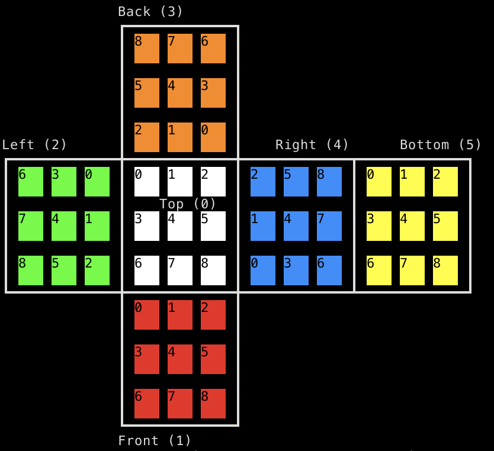

# Cube Data API

The cube data is stored in an SQL database, accessible via HTTP, and can output JSON format.

## Basic usage

The API is accesed via the following url:

    https://giant-led-cube-db.46bit.cloud

To use it, send an SQL command in the post data. Examples below.

The DBMS is ClickHouse, see here for the docs: https://clickhouse.com/docs/en/intro

Of particular interest will be the syntax reference for it's flavour of SQL: https://clickhouse.com/docs/en/sql-reference

## Schema

We might change the schema, but we'll probably not remove things.

The scheme is defined in [this file](datapoints/schema.sql)

To see the current schema on the live version you can inspect it with the following commands:

Get the list of tables:

    curl https://giant-led-cube-db.46bit.cloud -d 'SHOW TABLES'

Get the structure of the "game_solves" table:

    curl https://giant-led-cube-db.46bit.cloud -d 'DESCRIBE TABLE game_solves'

Here is the schema as of time of writing:

    > curl https://giant-led-cube-db.46bit.cloud -d 'SHOW TABLES'
    game_solves
    game_starts
    twists
    
    > curl https://giant-led-cube-db.46bit.cloud -d 'DESCRIBE TABLE game_solves'
    game_id                 String                 Unique identifier of this game		
    play_time_milliseconds  UInt32                 How long the solve took, in milliseconds		
    new_top_score           Bool                   Whether the cube recognised this as a new top score		
    cube_state              String                 Solved cube face positions		
    timestamp               DateTime64(6, \'UTC\') Milliseconds since the unix epoch		
    
    > curl https://giant-led-cube-db.46bit.cloud -d 'DESCRIBE TABLE game_starts'
    game_id    String                 Unique identifier of this game		
    cube_state String                 Starting cube face positions		
    timestamp  DateTime64(6, \'UTC\') Milliseconds since the unix epoch		
    
    > curl https://giant-led-cube-db.46bit.cloud -d 'DESCRIBE TABLE twists'
    rotation               String                 The cube rotation in standard notation https://ruwix.com/the-rubiks-cube/notation/	
    cube_state             String                 Updated cube face positions		
    game_id                Nullable(String)       Game unique ID (only if this twist happened during an active game)		
    play_time_milliseconds Nullable(UInt32)       How long the solve attempt has taken so far, in milliseconds	
    timestamp              DateTime64(6, \'UTC\') Milliseconds since the unix epoch	

## Game IDs

Currently the game ID is really _really_ awful. It's a stringified platform-dependent rust struct. We plan to fix that at some point, but for now it's a string that should be unique to each solve since it's a fairly precise time (the start time of the game).

Be prepared for this type to become something more sensible. Perhaps we'll try to keep it as a string at least.

## JSON output

You can get JSON output by adding `FORMAT JSON` to the end of your query

Normally you just want the `data` field from the returned json text. There's other metatdata in the json text too, in the other top level fields.

you can use the `jq` tool to throw away everything except the data:

    curl ... | jq .data

## Examples

Get a list of all solve attempts ordered by time taken (fastest first) in json format:

    curl https://giant-led-cube-db.46bit.cloud -d 'select * from game_solves order by play_time_milliseconds asc format JSON' | jq .data

Get a list of the twists associated with a particular solve attempt, in the order they were executed, in json format:

    curl https://giant-led-cube-db.46bit.cloud -d "select * from twists where (game_id == '<game_id_here>') order by timestamp asc format JSON" | jq .data

## Cube states

Some tables have `cube_state` fields. These are strings representing the absolute state of the cube at the given moment.

This is just a 54 char long string of single-character colour names.

The names are:

    Y, O, G, R, B, and W (Yellow, Orange, Green, Red, Blue, and White).

Note that the colour names might not be the actual colours used on the cube. Hopefully we finish implementing high-contrast mode to enable people with colour blindness or similar visual impairments to play. If that's the case then the cube might display a high contrast colour scheme but still use these colour names regardless.

Each character is one of the 9 subfaces on one of the six faces of the cube.

The faces are ordered thusly:

    Top, Front, Left, Back, Right, Bottom

The order of the subfaces within the face follows this pattern:

    0, 1, 2
    3, 4, 5
    6, 7, 8

The way that the faces align with each other is according to this diagram:

                  Back (3)
                  ┏━━━━━━━━━━━━━┓
                  ┃ 8   7   6   ┃
                  ┃             ┃
                  ┃             ┃
                  ┃ 5   4   3   ┃
                  ┃             ┃
                  ┃             ┃
                  ┃ 2   1   0   ┃
    Left (2)      ┃             ┃    Right (4)      Bottom (5)
    ┏━━━━━━━━━━━━━╋━━━━━━━━━━━━━╋━━━━━━━━━━━━━┳━━━━━━━━━━━━━┓
    ┃ 6   3   0   ┃ 0   1   2   ┃ 2   5   8   ┃ 0   1   2   ┃
    ┃             ┃             ┃             ┃             ┃
    ┃             ┃    Top (0)  ┃             ┃             ┃
    ┃ 7   4   1   ┃ 3   4   5   ┃ 1   4   7   ┃ 3   4   5   ┃
    ┃             ┃             ┃             ┃             ┃
    ┃             ┃             ┃             ┃             ┃
    ┃ 8   5   2   ┃ 6   7   8   ┃ 0   3   6   ┃ 6   7   8   ┃
    ┃             ┃             ┃             ┃             ┃
    ┗━━━━━━━━━━━━━╋━━━━━━━━━━━━━╋━━━━━━━━━━━━━┻━━━━━━━━━━━━━┛
                  ┃ 0   1   2   ┃
                  ┃             ┃
                  ┃             ┃
                  ┃ 3   4   5   ┃
                  ┃             ┃
                  ┃             ┃
                  ┃ 6   7   8   ┃
                  ┃             ┃
                  ┗━━━━━━━━━━━━━┛
                  Front (1)

Here is a screenshot of that diagram with colours:

For some rust code that can parse and maipulate these cube states, take a look at the `cube_model` crate in this repository. The `Cube::deserialise` function takes these `cube_state` strings as input.
